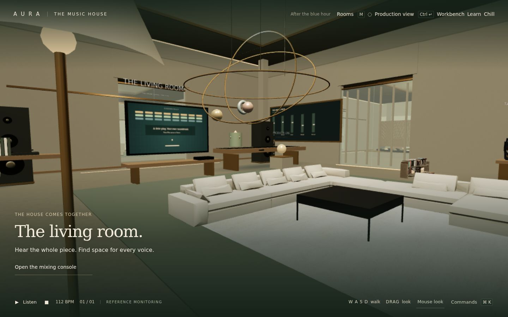

# AURA — The Music House / 0.4.1

**[Try the live music house](https://aura-music-studio.rhythmx.chatgpt.site)** · **[Anis Chelli’s portfolio](https://anischelly26.github.io/treasure-hunter/)**



A working first-person music house built around the existing Web Audio workstation. Nine connected spaces lead from an idea to an editable arrangement and a real exported WAV. The house combines procedural architecture with optimized furniture and exterior models from the five supplied FBX packs; its piano, rhythm pads, screens and mix installation are interactive.

This release expands the house into a deeper local workstation with real synthesis, insert racks, playable MIDI performance, reference listening, and multiformat delivery. Commercial native DAW parity remains future work.

The [1 October ruthless audit](docs/audit-2026-10-01/AUDIT.md) documents reproduced defects, repairs, actual room screenshots, measurements and remaining gaps. This patch does not establish professional mastering, hardware performance or accessibility conformance.

## Open immediately

After running `npm ci` and `npm run build`, double-click the generated **AURA.html**, or on Windows use **START_AURA.bat**. Three.js, styles, synthesis and all application code are bundled in that single file. No runtime network connection or paid API is needed. A current browser with WebGL2 renders the house. If graphics are unavailable, the precise production tools and room-tool index remain available.

Arrival is silent unless you explicitly enable the optional note. Click Enter for the default 3.2-second live passage through the actual architecture, or Skip for immediate access. Settings also offer an 8.2-second arrival, reduced motion, or no arrival. Press Space to hear the original editable eight-bar starter.

Use the hosted version or localhost for microphone capture. Local-file persistence and microphone behavior vary by browser. Download an editable `.aura` project to keep an independent backup, including imported samples.

## Run from source

Requires Node.js 20 or later.

```sh
npm ci
npm start
```

Open http://localhost:3000. `npm test` runs 23 project, recipe, routing, phrase, MIDI, ZIP and PCM tests. `npm run build` produces the static `dist/` app and rebuilds portable `AURA.html`. `node bundle.mjs` rebuilds only the portable file. Dependency versions are pinned; the built release has no CDN dependencies.

## The connected house

| Key | Room | Working purpose |
| --- | --- | --- |
| 1 | Entry gallery | Open saved sessions, start an empty project, keep and restore actual version checkpoints |
| 2 | Idea room | Capture a voice, open keys, transform the original starter with transparent local rules |
| 3 | Instrument gallery | Click real synthesized piano keys and instrument objects; open precise MIDI editing |
| 4 | Rhythm room | Toggle actual kick/snare/hat notes on the circular pads; open the 16-step editor |
| 5 | Recording room | Choose microphone, record a take, view real waveform, control input gain and optional monitoring |
| 6 | Arrangement hall | View actual clip data on the wall; move, resize, split, duplicate and edit clips in production mode |
| 7 | Living room | Actual track sculptures and mixer: pan, gain, mute, solo, effects, live peak/RMS and spectral centroid |
| 8 | Listening room | Real reference A/B, full-render RMS matching, sample peak, RMS, crest factor, correlation, spectrum, phase scope and monitor-only simulations |
| 9 | Export terrace | 16/24-bit WAV at 44.1/48 kHz, aligned track stems ZIP, standard MIDI and editable project |

WASD or arrow keys walk, drag looks, and clicking an empty nearby floor sets a walking target. The explicit Mouse look button enables pointer lock; Escape releases it. E interacts with the focused object. Standard controller axes support walking and looking, with A for interaction; physical controller testing is still pending. M opens the room map. Room shortcuts use clearance-aware pathfinding through connected portals around the main furniture; Shift+room number or Shift+room-map click makes them immediate; reduced motion also uses instant travel. Speed, mouse sensitivity, movement response and field of view persist on this device.


On phones and tablets, hold and drag the **MOVE** circle to walk or strafe. Drag the scene with a second finger to look around while walking, then tap **Interact** to use the object at the center of your view or open the current room's tools. The Rooms button is available for guided travel. Touch controls use the same collision and movement smoothing as the keyboard, respect screen safe areas, and reset when canceled, resized, backgrounded, or covered by a music tool. Controls stay hidden during arrival, dialogs, production view and the graphics fallback. Published asset versions change with the bundle and styles so returning visitors receive the fix.

The [mobile verification](docs/mobile-navigation/verification.json) exercises real Chromium touch input at 390×844, 320×568 and 844×390, simultaneous fingers, release/cancel, collisions, production mode, offline models and desktop keyboard movement. This is browser emulation; physical iOS/Android hardware performance remains unverified. After building, run `node tools/verify-mobile-navigation.cjs` with Playwright installed; `AURA_CHROMIUM_PATH` optionally selects Chromium.

Ctrl/Cmd+Enter switches between the house and precise Production view. Native Tab traverses controls; canvas-focused Tab also switches views. Each music room opens its relevant tools; navigation never creates another audio engine or restarts the song. When WebGL is unavailable, the room map opens those tools directly.

Balanced, Full experience and Performance graphics modes control resolution and shadows. Reduced motion disables kinetic art and animated navigation. Static meshes, including lamps, books, racks, plants, acoustic timber, turntable detail and cables, are batched by material and room. Production view and open tool dialogs suspend background world rendering and animation. Balanced mode caches static contact shadows; the nearest three room lights are active. Settings display measured FPS, draw calls and triangle count. No fixed frame rate or hardware performance guarantee is made.

## Learn and unwind

**Learn** opens seven short lessons covering pulse, melody, chords, bass, arrangement, mixing and export. Read a lesson without changing the session; add or open a separate two-bar practice track when ready. Practice edits use the normal undo and save paths. Project checks report observable note/clip facts, not judgments about the sound. Quiz progress is stored on this device. Guided questions use explicitly labeled local music-theory rules.

**Chill** opens Sundown Rally from the living-room console, room map, house/production toolbar or command palette. Use mouse, touch or left/right arrows; Space pauses the game. A missed ball is returned without a lives limit. The game is silent and does not restart or stop project playback. Closing it pauses its animation. Standard gamepad paddle input is implemented; physical controller validation is pending.

The spacious interior supplies the lounge sofa/table; the Japanese room supplies a retro TV and books; the loft supplies the recording listening area; the chairs/window pack furnishes a reading nook; the villa appears outside and as a gallery study. Unneeded room shells and HDRI spheres were excluded. Converted GLBs and textures total 5.3 MB, with textures capped at 1024 px. They are also embedded in the portable HTML for offline use. [Asset provenance](assets/models/manifest.json) records the original pack hashes and selected mesh names. The supplied archives contain no license/author manifest; no new authorship or license grant is claimed.

Freeform AI is **not connected in the published static edition**. The guided coach works offline. A server-only Responses API boundary in `src/coach-api.js` is wired to the local development server, requires `OPENAI_API_KEY` and an explicit `AURA_COACH_MODEL`, bounds its context, limits requests, and never sends audio or asset contents. Its provider behavior was verified with a fixture, not a live model. Hosted AI activation requires the OpenAI Developers connection, a secret configured through Sites, and a Worker deployment of this same site. No browser API key input is provided. Static builds disable provider discovery rather than issuing failing API requests.

[Update verification](docs/update-0.4/UPDATE.md) covers rendered furniture, lessons, game input, transport continuity and save/reload.

## Actual music capabilities

- Sixteen distinct synthesized voices: harmonic keys, detuned pad, sub bass, pluck, analog lead, drum instrument, FM tine piano, drawbar organ, FM bell, wood mallet, detuned string ensemble, flute, reed, brass, vowel choir and wire harp. Attack, release and brightness are editable. The physical piano has 88 individually mapped keys; its sound is synthesized, not a sampled acoustic grand.
- Polyphonic held-note performance from the on-screen keyboard or computer keys A W S E D F T G Y H U J K O L P ;. Optional Web MIDI access is requested only by Connect MIDI input; pitch, note-on/off and velocity are supported. Four-beat audio count-in captures performances at selected clip beat zero, commits as one undoable operation, and keeps the project transport independent. Capture stops at clip end. Hardware MIDI testing remains pending.
- Studio Workbench is accessible in the house, precision view and command palette. It shares the same project and engine; it does not create a separate session.
- 4/4 transport, 40–240 BPM, tap tempo, loop, metronome, key and six scale settings.
- Arrangement clips: select, move, resize, duplicate, split at playhead, delete, snap and zoom. Double-click an empty instrument lane to add a phrase. Maximum 64 tracks / 256 beats.
- Piano roll: double-click to draw; drag to move; drag right edge to resize; right-click or Delete to remove; velocity, quantize, deterministic humanization, scale highlighting, synthesized keyboard audition.
- Chord pads insert scale-derived triads with selectable inversions into the selected clip. Whole-phrase octave transpose, legato, strum, chop, arpeggiate, reverse and repeat are undoable.
- Six musical scales and optional local diatonic harmony suggestions: inspect ghost notes, audition, accept, reject and undo. No generative model is connected.
- Idea recipes recognize a BPM, a key such as F major/D minor/G dorian, bright/uplifting/hopeful, ambient/no drums, minimal/sparse and piano only. They transform the same original starter; they do not interpret arbitrary prompts or generate new music with AI.
- Eleven actual synthesized drum voices: kick, snare, clap, closed/open hats, low/high toms, ride, crash, shaker and conga. Three kit characters change synthesis parameters. Sixteen-step drum editor, fill pattern and offbeat swing. It edits the first four beats of a drum clip; longer clips may contain further notes.
- Audio import up to 20 MB / six minutes per supported file. Actual decoded waveform, embedded original audio, trim and split with offset preservation. The audio library searches local filenames/category tags, displays real decoded waveforms, supports favorites, preview and placement at the playhead. BPM/key tags are entered by the user; no detection or AI search is claimed. Clip gain, fade-in/out and reversal use the shared playback/export path. Reversal offsets count from the start of the reversed buffer. Audio does not time-stretch when tempo changes.
- Microphone recording through browser MediaRecorder, maximum six minutes per take. Input gain and optional monitoring; microphone access occurs only on Record. The stopped take is decoded and inserted as an audio track at beat zero. This is not sample-aligned multitrack overdubbing. Browser recording may be compressed (typically Opus); exporting a WAV does not restore lost source detail.
- Real mixer gain, equal-power pan, mute, solo, live meters, 300 Hz parametric EQ, low-pass filter, optional compressor and convolution reverb send.
- Up to 12 inserts per channel: editable parametric EQ, compressor, feedback delay, saturation, chorus, tremolo, high-pass filter and stereo width. Reorder, bypass, wet/dry and locally saved chain presets. All eight processors are native Web Audio and run in both playback and offline renders. Insert parameters and bypass update live; adding/removing/reordering rebuilds playback at the current beat.
- Linear gain automation multiplying the track fader. Double-click adds points; drag edits; right-click removes.
- The house mix installation maps horizontal position to pan, depth to reverb send and size to measured RMS while playing. Height uses a measured spectral centroid during playback and the average MIDI register while idle. Sculpture geometry reflects voice families. These visual mappings are not a masking, phase or loudness diagnosis. The reference room measures pairwise power-spectrum similarity of audible tracks and explicitly avoids treating similarity as proof of masking. The separate 2D Mix Map retains MIDI-register height.
- Producer Lens uses live master sample peak/RMS, clipping observations and an optional reversible gain proposal. No LUFS, true-peak, automatic mastering or unmeasured sonic claims.
- Real decoded reference-track A/B at the same elapsed position; optional full-project-render RMS matching trims the reference (maximum +12 dB, also constrained by sample peak). Reference audio lives in the listening session. RMS trim is additionally bounded to preserve sample-peak headroom; exact RMS matching may be constrained. Stereo, mono and 300–3400 Hz small-speaker monitoring affect only the listening output, never the rendered master. Live project correlation and phase scope are measured before monitoring.
- Undo/redo, IndexedDB autosave, recent sessions, portable `.aura` import/export with embedded samples, last-session restoration, complete named checkpoints in a separate store. The gallery displays up to five checkpoint sculptures; the version list contains all kept checkpoints. Autosave also retains five previous project snapshots at one-minute intervals, reachable from Workbench / Recovery. Browser storage quotas apply.
- Real stereo WAV render through the same synthesis, effects, routing and automation functions as playback. PCM16/24 at 44.1/48 kHz; instrument/reverb/effect tails, with feedback-delay tails capped at 30 seconds; maximum approximately 6½ minutes including tails. Standard MIDI format 1 / 480 PPQ retains notes, tempo, velocity and clip placement. Aligned post-channel stems use the same duration and project master level; ZIP batches support up to 24 audible tracks and include the MIDI session. The encoder clips samples above full scale and reports an over-level render; reduce master gain before re-exporting.

## Production shortcuts

| Action | Shortcut |
| --- | --- |
| Play / pause | Space |
| Stop and rewind | Shift + Space |
| Save | Ctrl/Cmd + S |
| Undo / redo | Ctrl/Cmd + Z / Ctrl/Cmd + Shift + Z |
| Duplicate clip | Ctrl/Cmd + D |
| Commands, including room destinations and checkpoints | Ctrl/Cmd + K |
| Delete selection | Delete |

## Architecture

The existing v0.1 project schema, audio graph, scheduling, sample storage and editors were retained. A presentation adapter in `src/app.js` exposes the same state and commands to the house. The house owns no audio graph.

| Module | Responsibility |
| --- | --- |
| `src/project.js` | Project schema, validation, original starter, instruments, scales and bounded history |
| `src/workbench.js` | Instruments, insert editing, phrase/chord tools, audio library, reference room, deliverables and recovery UI |
| `src/effects.js` | Eight shared realtime/offline insert processors and rack disposal |
| `src/performance.js` | Held-note polyphony, computer/Web MIDI inputs and count-in capture |
| `src/analysis.js` | Measured RMS, sample peak, crest factor, correlation and spectrum similarity |
| `src/midi.js`, `src/zip.js` | Standard MIDI and offline ZIP encoding |
| `src/house/arrival.js`, `src/house/details.js`, `src/house/navigation.js` | Live intro, batched interior detail and collision-aware navigation |
| `src/audio.js` | Shared synthesis and audio graph, source scheduling, offline render, WAV encoding and actual measurements |
| `src/storage.js` | IndexedDB sessions and separate checkpoints, embedded samples and portable downloads |
| `src/ai.js` | Pure harmony rules and explicitly unavailable model-provider contract |
| `src/foundation.js` | Small, explicit text recipe transforming the original editable starter |
| `src/app.js` | Precise editors, selection, undoable commands and presentation adapter |
| `src/house/layout.js` | Connected room topology, route planning and stable project identity |
| `src/house/materials.js` | Procedural material textures and signage |
| `src/house/architecture.js` | Continuous geometry, portals, interactive instruments and actual project installations |
| `src/house/house.js` | First-person navigation, room/tool transitions, quality settings and room UI |
| `src/recording.js` | Explicit microphone capture, gain, monitoring, encoding and resource cleanup |
| `src/main.js` | App assembly and graphics fallback |
| `src/verify.html` | Real OfflineAudioContext regression page |

A worker wakes the 180 ms lookahead scheduler every 25 ms. Notes use AudioContext time; visual updates read measurements separately. Loop boundaries are scheduled ahead on the existing graph without restarting transport. Walking and mode changes do not restart project playback. Leaving reference tools returns to the project output. Playback pauses in a background tab. Arrangement or note edits rebuild playback at the current beat and can cause a small restart; seamless live editing is future work.

History uses up to 50 project snapshots; immutable encoded asset strings are shared in history while editable metadata is copied. Embedded audio and checkpoint copies are appropriate for small sessions but must move to content-addressed assets and patch commands before large-session use. The 3D house is one fixed connected layout, with project-dependent art and actual signal installations; it does not generate new architectural layouts. Main furniture uses conservative axis-aligned clearance bounds; walls, portals and house boundaries also constrain walking. Room paths use a grid search and sampled line-of-sight simplification. This is not a full physics engine; small decorative objects do not block movement.

## Verification

- Nineteen Node tests covering validation, history, recipes, routing, PCM16/24 encoding, standard MIDI track boundaries, ZIP structure and phrase transformations.
- Ten real OfflineAudioContext checks covering nonzero synthesis, render length, mute silence, hard-left pan, automation silence, solo routing, proportional master gain, valid WAV, round-trip decoding and extended delay tails.
- Chromium journey tests: silent entry, animated room navigation, physical piano raycast, MIDI drawing and undo/redo, drum edits, measured spectrum, uninterrupted playback across room changes, arrangement access, checkpoint restoration, actual microphone take decoding/insertion/release, reference controls and downloaded PCM WAV.
- Desktop and 390 px visual inspection; static built app and self-contained file checks. Browser fake microphone devices validate the capture path; physical audio-device latency and hardware-controller behavior remain unverified.

## Next production work

High-fidelity architectural lighting and asset detail; large-session performance profiling; seamless live edits; sample-aligned recording and overdub; multiselection and register navigation; time stretching; content-addressed audio; fuller routing and automation; native plugin support; measured loudness and true peak; accessible nonspatial editing refinements; and an optional real model integration with visible proposals and reversible edits.

The optional `tools/browser-journey.cjs` runner repeats the room-to-export regression. Install Playwright separately (`npm install --no-save playwright` and `npx playwright install chromium`), start the local server, then run `node tools/browser-journey.cjs`. `AURA_CHROMIUM_PATH` can select an existing Chromium binary. The runner uses a browser-provided fake microphone and writes verification downloads beside itself.

The optional `tools/v3-check.cjs` and `tools/v3-deep.cjs` runners cover the workbench, sixteen voices, all eight inserts, held-note capture, reference A/B, sample editing, and real WAV/MIDI/stem delivery. They use the same Playwright setup and localhost server. No physical MIDI device is assumed.
