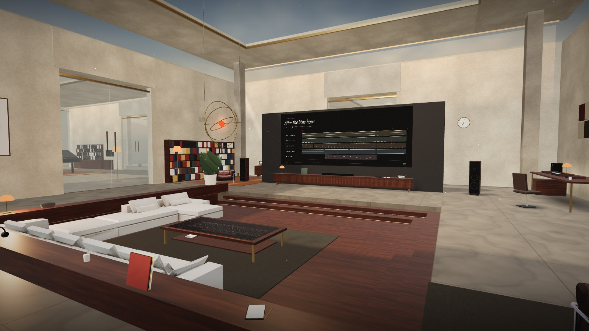

# AURA — The Music House / 0.5.0

**[Try the live music house](https://anischelly26.github.io/treasure-hunter/aura/)** · **[Anis Chelli’s portfolio](https://anischelly26.github.io/treasure-hunter/)**



A working first-person music house built around a Web Audio workstation. Nine connected rooms lead from an idea to an editable arrangement and a real exported WAV.

The house is the interface. The coffee table is the timeline: sit down and the arrangement rises into strips you move, trim, copy and loop by hand. The wall behind it shows the whole song. A drum machine, a synthesizer and a mixer stand on the desk with working pads, knobs and faders. A turntable plays the records on its rack and cuts bars from them into your project. A phone in your hand reaches everything else, and AURA, the brass halo above the table, answers questions and teaches by having you do the thing. One project, one transport and one audio engine sit behind all of it, and the precise editors are one shortcut away.

The architecture is procedural, furnished with optimized models from the five supplied FBX packs. Version 0.5.0 rebuilt the house; the audio engine, the project format and the editors are those of 0.4.2, described under [Actual music capabilities](#actual-music-capabilities). Commercial native DAW parity remains future work.

The [1 October ruthless audit](docs/audit-2026-10-01/AUDIT.md) documents the defects, repairs and measurements of 0.4.2. Nothing here establishes professional mastering, hardware performance or accessibility conformance.

## Open immediately

After running `npm ci` and `npm run build`, double-click the generated **AURA.html**, or on Windows use **START_AURA.bat**. Three.js, styles, synthesis and all application code are bundled in that single file. No runtime network connection or paid API is needed. A current browser with WebGL2 renders the house. If graphics are unavailable, the precise editor and every music tool remain available.

The first screen offers **Begin** and **Skip the arrival**, with a Sound switch that starts on; turn it off to enter in silence. Begin plays a fourteen-second arrival through the actual architecture, which Escape skips. Reduced motion skips it too, and it can be switched off under Settings in the phone. On a first visit AURA welcomes you and lights the way to the living room. Press Space to hear the original editable eight-bar starter. Audio starts from your first gesture. On supported iPhones, AURA selects the music playback session so Silent Mode does not mute the instruments. After an audio interruption, press play again; the transport resumes at its paused position. Older iOS versions without Audio Session support may still require turning off Silent Mode.

Use the hosted version or localhost for microphone capture. Local-file persistence and microphone behavior vary by browser. Download an editable `.aura` project to keep an independent backup, including imported samples.

## Run from source

Requires Node.js 20 or later.

```sh
npm ci
npm start
```

Open http://localhost:3000 (`npm run dev` serves the same thing on port 4173). `npm test` runs 23 project, recipe, routing, phrase, MIDI, ZIP and PCM tests. `npm run build` produces the static `dist/` app and rebuilds portable `AURA.html`. `node bundle.mjs` rebuilds only the portable file. Dependency versions are pinned; the built release has no CDN dependencies.

## The connected house

| Key | Room | Working purpose |
| --- | --- | --- |
| 1 | Entry | Your projects hang here: open a saved session or start an empty one. Kept versions stand on the ledge by the door |
| 2 | AURA lab | Describe a feeling and transparent local rules draft an editable beginning from the original starter |
| 3 | Synth room | A synthesizer with working oscillator, filter and envelope controls, and a grand with 88 playable keys; opens the piano roll |
| 4 | Drum room | A drum machine with velocity-sensitive pads and a sixteen-step row; opens the step editor |
| 5 | Vocal room | Choose a microphone, record a take, see its real waveform, set input gain and optional monitoring |
| 6 | Sampling room | Records, tape and the long view of the song; opens the arrangement |
| 7 | Living room | The timeline table, the arrangement wall, the desk (drum machine, synthesizer, mixer), the turntable, AURA, and a console on the wall |
| 8 | Mixing room | A full-size desk and real meters; reference A/B, RMS matching, sample peak, crest factor, correlation, spectrum, phase scope and monitor-only simulations |
| 9 | Terrace | 16/24-bit WAV at 44.1/48 kHz, aligned track stems ZIP, standard MIDI and the editable project |

### Moving and using

Click the picture to look around with the mouse; Escape gives the cursor back. WASD or the arrow keys walk and Shift hurries. Aim at something and a two-word prompt names what it is; **E** or a click uses it. Using an instrument moves you in to a designed view of it where the cursor is free: drag knobs, faders and clips directly, and press Escape to step back. Chairs, sofas and the piano bench can be sat on. Number keys 1–9 walk you to a room along a clearance-aware path, and Shift makes the trip immediate, as does reduced motion. Walking pace, look sensitivity and field of view persist on this device.

| Key | Does |
| --- | --- |
| Tab | The phone: now playing, projects, records, samples, AURA, map, notes, settings |
| T or Enter | Ask AURA a question in your own words |
| L | Just listen: the interface clears and the light changes while the music plays |
| M | The map |
| Space | Play or pause |
| Ctrl/Cmd + Enter | The precise editor and back |
| Ctrl/Cmd + K | Commands, including every room and kept versions |

At the timeline table: drag a clip to move it, take an edge to trim or resize, hold Alt and drag to carry a copy, drag along the ruler to loop a section, S splits, Q quantizes. Every gesture is one ordinary undoable edit of the same project the precise editor works on. Navigation never creates another audio engine or restarts the song.

### On a phone or tablet

Drag the picture to look, hold the **MOVE** pad to walk, and tap the floor to walk there. Tap an object to use it, or tap **USE** for whatever is at the centre of the frame, which a small dot marks. At an instrument the pad steps aside and the button reads **BACK**. The phone becomes a sheet at the bottom of the screen with two touch instruments of its own, **Beat** (sixteen steps for each drum) and **Keys** (pads that are always in the project's scale). Instrument views fit an upright phone but are small there; turned sideways they are closer. Touch controls use the same collision and movement as the keyboard, respect safe areas, and stay hidden during the arrival, in sheets, in the precise editor and in the graphics fallback.

This was checked with emulated touch input in headless Chrome at 390×844 and 844×390. Physical iOS and Android devices, and their performance, remain unverified. The 0.4.2 [mobile navigation](docs/mobile-navigation/verification.json) and [mobile audio](docs/mobile-audio/verification.json) records describe the earlier controls; the audio findings still apply, since the engine is unchanged.

### Graphics

Low, Medium, High and Ultra control resolution, shadows, reflections, the number of live lights and, from High up, bloom from the house's real light sources. Auto picks one from the reported graphics adapter. In every mode the house trims resolution when the frame rate sags and restores it when there is headroom. The music tools are identical in every mode. Static meshes are batched by material and room; only the room you are in and its neighbours are drawn; the precise editor and open sheets suspend world rendering. Settings shows measured FPS, draw calls and triangles.

On the development laptop's integrated Intel UHD graphics, Auto selects Medium. Measured there in headless Chrome at 1440×810 with music playing, the house ran between about 60 and 110 frames per second depending on the room; the living room, the heaviest, read between 59 and 77 from one run to the next, which is also how much these readings vary. High and Ultra are meant for discrete graphics and ran at 25 and 15 on the same laptop. That is one machine; no frame rate or hardware performance guarantee is made. When WebGL is unavailable, the precise editor opens directly with every music tool, and room commands open each room's tools instead of walking there.

## Learn and unwind

**AURA school** teaches by doing. Ask AURA to teach you, or pick a lesson in the phone: rhythm, synthesis, mixing, arranging and sampling. AURA lights the way to the instrument, or walks you there, and each step waits for your hands: hit the kick, light four steps, turn the swing, drag a clip, cut two bars from a record. Nothing advances on a timer, a step can be skipped, and everything you do in a lesson is a real, undoable edit of your project.

**AURA** also answers questions in the project's own terms (its key, its tempo, what is playing at the bar you are on) and can write drums, a bass line, chords or a motif, each as one undoable step. It runs on this device with transparent rules; it is not a language model unless a server connection is configured, as described below.

**Learn**, in the precise editor and the phone's AURA page, opens seven short reading lessons covering pulse, melody, chords, bass, arrangement, mixing and export. Read a lesson without changing the session; add or open a separate two-bar practice track when ready. Practice edits use the normal undo and save paths. Project checks report observable note/clip facts, not judgments about the sound. Quiz progress is stored on this device. Guided questions use explicitly labeled local music-theory rules.

**Records.** The turntable's rack holds your open project, anything you have pressed, and six AURA originals that are composed by rule on demand, not recorded. Press to vinyl, in the phone's Now playing, puts the project on the rack with a sleeve you choose; a pressed record plays the session it was cut from. One, two or four bars of any record can be cut into the project as a new audio track.

**Sundown Rally** plays on the living-room wall from the console beneath it, and opens as a sheet from Chill in the precise editor or the command palette. Use mouse, touch or left/right arrows; Space pauses the game. A missed ball is returned without a lives limit. The game is silent and does not restart or stop project playback. Standard gamepad paddle input is implemented; physical controller validation is pending.

The spacious interior supplies the sofa built into the corner of the sunken lounge; the loft supplies a green room outside the vocal booth and two living-room armchairs; the Japanese room supplies an old television and a game shelf; the chairs/window pack furnishes a window seat in the AURA lab; the villa stands in the landscape and, at one tenth scale, on a plinth by the front door. Unneeded room shells and HDRI spheres were excluded. Converted GLBs and textures total 5.3 MB, with textures capped at 1024 px. They are also embedded in the portable HTML for offline use. [Asset provenance](assets/models/manifest.json) records the original pack hashes and selected mesh names. The supplied archives contain no license/author manifest; no new authorship or license grant is claimed.

Freeform AI is **not connected in the published static edition**. AURA and the guided coach work offline, by rule. A server-only Responses API boundary in `src/coach-api.js` is wired to the local development server, requires `OPENAI_API_KEY` and an explicit `AURA_COACH_MODEL`, bounds its context, limits requests, and never sends audio or asset contents. Its provider behavior was verified with a fixture, not a live model. Hosted AI activation requires the OpenAI Developers connection, a secret configured through Sites, and a Worker deployment of this same site. No browser API key input is provided. Static builds disable provider discovery rather than issuing failing API requests.

The 0.4 [update verification](docs/update-0.4/UPDATE.md) covers the furniture models, the reading lessons, game input, transport continuity and save/reload as they were before the house was rebuilt.

## Actual music capabilities

- Sixteen distinct synthesized voices: harmonic keys, detuned pad, sub bass, pluck, analog lead, drum instrument, FM tine piano, drawbar organ, FM bell, wood mallet, detuned string ensemble, flute, reed, brass, vowel choir and wire harp. Attack, release and brightness are editable. The physical piano has 88 individually mapped keys; its sound is synthesized, not a sampled acoustic grand.
- Polyphonic held-note performance from the on-screen keyboard or computer keys A W S E D F T G Y H U J K O L P ;. Optional Web MIDI access is requested only by Connect MIDI input; pitch, note-on/off and velocity are supported. Four-beat audio count-in captures performances at selected clip beat zero, commits as one undoable operation, and keeps the project transport independent. Capture stops at clip end. Hardware MIDI testing remains pending.
- Studio Workbench is accessible in the house, precision view and command palette. It shares the same project and engine; it does not create a separate session.
- 4/4 transport, 40–240 BPM, tap tempo, loop, metronome, key and six scale settings.
- Arrangement clips: select, move, resize, duplicate, split at playhead, delete, snap and zoom. Double-click an empty instrument lane to add a phrase. Maximum 64 tracks / 256 beats.
- Piano roll: double-click to draw; drag to move; drag right edge to resize; right-click or Delete to remove; velocity, quantize, deterministic humanization, scale highlighting, synthesized keyboard audition.
- Chord pads insert scale-derived triads with selectable inversions into the selected clip. Whole-phrase octave transpose, legato, strum, chop, arpeggiate, reverse and repeat are undoable.
- Six musical scales and optional local diatonic harmony suggestions: inspect ghost notes, audition, accept, reject and undo. No generative model is connected.
- Idea recipes recognize a BPM, a key such as F major/D minor/G dorian, bright/uplifting/hopeful, ambient/no drums, minimal/sparse and piano only. They transform the same original starter; they do not interpret arbitrary prompts or generate new music with AI.
- Eleven actual synthesized drum voices: kick, snare, clap, closed/open hats, low/high toms, ride, crash, shaker and conga. Three kit characters change synthesis parameters. Sixteen-step drum editor, fill pattern and offbeat swing. It edits the first four beats of a drum clip; longer clips may contain further notes.
- Audio import up to 20 MB / six minutes per supported file. Actual decoded waveform, embedded original audio, trim and split with offset preservation. The audio library searches local filenames/category tags, displays real decoded waveforms, supports favorites, preview and placement at the playhead. BPM/key tags are entered by the user; no detection or AI search is claimed. Clip gain, fade-in/out and reversal use the shared playback/export path. Reversal offsets count from the start of the reversed buffer. Audio does not time-stretch when tempo changes.
- Microphone recording through browser MediaRecorder, maximum six minutes per take. Input gain and optional monitoring; microphone access occurs only on Record. The stopped take is decoded and inserted as an audio track at beat zero. This is not sample-aligned multitrack overdubbing. Browser recording may be compressed (typically Opus); exporting a WAV does not restore lost source detail.
- Real mixer gain, equal-power pan, mute, solo, live meters, 300 Hz parametric EQ, low-pass filter, optional compressor and convolution reverb send.
- Up to 12 inserts per channel: editable parametric EQ, compressor, feedback delay, saturation, chorus, tremolo, high-pass filter and stereo width. Reorder, bypass, wet/dry and locally saved chain presets. All eight processors are native Web Audio and run in both playback and offline renders. Insert parameters and bypass update live; adding/removing/reordering rebuilds playback at the current beat.
- Linear gain automation multiplying the track fader. Double-click adds points; drag edits; right-click removes.
- The Mix Map in the precise editor places each track by stereo position and MIDI register, sized by measured RMS while playing. These visual mappings are not a masking, phase or loudness diagnosis. The reference tools measure pairwise power-spectrum similarity of audible tracks and explicitly avoid treating similarity as proof of masking. The track sculptures that showed the mix in the 0.4.2 living room are not part of the rebuilt house; a mixer with real faders and meters stands there instead.
- Producer Lens uses live master sample peak/RMS, clipping observations and an optional reversible gain proposal. No LUFS, true-peak, automatic mastering or unmeasured sonic claims.
- Real decoded reference-track A/B at the same elapsed position; optional full-project-render RMS matching trims the reference (maximum +12 dB, also constrained by sample peak). Reference audio lives in the listening session. RMS trim is additionally bounded to preserve sample-peak headroom; exact RMS matching may be constrained. Stereo, mono and 300–3400 Hz small-speaker monitoring affect only the listening output, never the rendered master. Live project correlation and phase scope are measured before monitoring.
- Undo/redo, IndexedDB autosave, recent sessions, portable `.aura` import/export with embedded samples, last-session restoration, complete named checkpoints in a separate store. Up to five kept versions stand as cards on the ledge by the front door; the version list contains all of them. Autosave also retains five previous project snapshots at one-minute intervals, reachable from Workbench / Recovery. Browser storage quotas apply.
- Real stereo WAV render through the same synthesis, effects, routing and automation functions as playback. PCM16/24 at 44.1/48 kHz; instrument/reverb/effect tails, with feedback-delay tails capped at 30 seconds; maximum approximately 6½ minutes including tails. Standard MIDI format 1 / 480 PPQ retains notes, tempo, velocity and clip placement. Aligned post-channel stems use the same duration and project master level; ZIP batches support up to 24 audible tracks and include the MIDI session. The encoder clips samples above full scale and reports an over-level render; reduce master gain before re-exporting.

## Production shortcuts

| Action | Shortcut |
| --- | --- |
| Play / pause | Space |
| Stop and rewind | Shift + Space |
| Save | Ctrl/Cmd + S |
| Undo / redo | Ctrl/Cmd + Z / Ctrl/Cmd + Shift + Z |
| Duplicate clip | Ctrl/Cmd + D |
| Commands, including room destinations and checkpoints | Ctrl/Cmd + K |
| Delete selection | Delete |

## Architecture

The existing v0.1 project schema, audio graph, scheduling, sample storage and editors were retained. A presentation adapter in `src/app.js` exposes the same state and commands to the house. The house owns no audio graph: every instrument in it reads and edits the project through that adapter, so a knob turned on the desk, a step lit on the phone and a note drawn in the piano roll are the same edit.

| Module | Responsibility |
| --- | --- |
| `src/project.js` | Project schema, validation, original starter, instruments, scales and bounded history |
| `src/workbench.js` | Instruments, insert editing, phrase/chord tools, audio library, reference room, deliverables and recovery UI |
| `src/effects.js` | Eight shared realtime/offline insert processors and rack disposal |
| `src/performance.js` | Held-note polyphony, computer/Web MIDI inputs and count-in capture |
| `src/analysis.js` | Measured RMS, sample peak, crest factor, correlation and spectrum similarity |
| `src/midi.js`, `src/zip.js` | Standard MIDI and offline ZIP encoding |
| `src/house/navigation.js`, `src/house/touch-navigation.js` | Collision-aware route planning; the touch pad and its one button |
| `src/audio.js` | Shared synthesis and audio graph, source scheduling, offline render, WAV encoding and actual measurements |
| `src/storage.js` | IndexedDB sessions and separate checkpoints, embedded samples and portable downloads |
| `src/ai.js` | Pure harmony rules and explicitly unavailable model-provider contract |
| `src/foundation.js` | Small, explicit text recipe transforming the original editable starter |
| `src/app.js` | Precise editors, selection, undoable commands and presentation adapter |
| `src/house/layout.js` | Connected room topology, the sunken lounge and stable project identity |
| `src/house/materials.js` | The palette, procedural material textures, lettering, and textures for displays that are redrawn live |
| `src/house/architecture.js`, `src/house/rooms.js`, `src/house/props.js` | Continuous geometry and portals; what stands in each room; lamps, shelves, seats and other furniture built in code |
| `src/house/model-assets.js` | Placement of the converted furniture models and the places to sit on them |
| `src/house/house.js` | The world manager: input, room and tool transitions, focus views, sitting, listening mode, the frame loop and the graphics fallback |
| `src/world/player.js`, `src/world/camera.js`, `src/world/interaction.js` | The body and its collisions; designed camera moves into and out of instruments; aiming, prompts and the press/drag/release language |
| `src/world/lighting.js`, `src/world/quality.js` | Sky, sun, weather, moods and the few live interior lights; graphics presets, the frame governor and the bloom pass |
| `src/world/screens.js`, `src/world/hud.js`, `src/world/sound.js`, `src/world/intro.js` | Displays painted from the real project and meters; on-screen lettering; interface sound; the arrival |
| `src/world/device.js`, `src/world/objects/*` | Knobs, faders, buttons and pads bound to the project; the timeline table, drum machine, synthesizer, mixer, turntable, console and AURA's halo |
| `src/system/playback.js`, `src/system/composer.js` | One listening state for the project, pressed records and AURA originals; the rule-based writer behind the originals |
| `src/system/phone.js`, `src/system/mentor.js`, `src/system/guide.js` | The phone and its apps; AURA's answers and project edits; the first visit and the hands-on lessons |
| `src/recording.js` | Explicit microphone capture, gain, monitoring, encoding and resource cleanup |
| `src/main.js` | App assembly and graphics fallback |
| `src/verify.html` | Real OfflineAudioContext regression page |

A worker wakes the 180 ms lookahead scheduler every 25 ms. Notes use AudioContext time; visual updates read measurements separately. Loop boundaries are scheduled ahead on the existing graph without restarting transport. Walking and mode changes do not restart project playback. Leaving reference tools returns to the project output. Playback pauses in a background tab. Arrangement or note edits rebuild playback at the current beat and can cause a small restart; seamless live editing is future work.

History uses up to 50 project snapshots; immutable encoded asset strings are shared in history while editable metadata is copied. Embedded audio and checkpoint copies are appropriate for small sessions but must move to content-addressed assets and patch commands before large-session use. The 3D house is one fixed connected layout. The open project hangs in the entry as its own sleeve, and every display is painted from the real project and the real meters; the house does not generate new architectural layouts. Main furniture uses conservative axis-aligned clearance bounds; walls, portals and house boundaries also constrain walking. Room paths use a grid search and sampled line-of-sight simplification. This is not a full physics engine; small decorative objects do not block movement.

## Verification

- Twenty-three Node tests covering validation, history, recipes, routing, PCM16/24 encoding, standard MIDI track boundaries, ZIP structure, phrase transformations and the room layout.
- Ten real OfflineAudioContext checks covering nonzero synthesis, render length, mute silence, hard-left pan, automation silence, solo routing, proportional master gain, valid WAV, round-trip decoding and extended delay tails.
- The rebuilt house, driven in headless Chrome on the GPU with real pointer, keyboard and touch events by the scenarios in `tools/house/`: the five hands-on lessons from first line to last; every phone app; pressing a record and playing it from the rack; cutting bars from a record; every seat; the five skies; listening mode; the console game on the wall; the four graphics presets; an upright and a sideways phone; and the fallback with WebGL disabled. Each run also reports the page's console errors. `tools/house/smoke.cjs` makes a short pass over whatever `AURA_URL` points at, and was run against the source, `dist/` and `AURA.html` opened from disk.
- Frame rate and first-visit cost at fixed vantage points, by `tools/house/performance.cjs`.
- For 0.4.2, Chromium journey tests of the precise editors: MIDI drawing and undo/redo, drum edits, measured spectrum, uninterrupted playback across room changes, checkpoint restoration, actual microphone take decoding/insertion/release, reference controls and downloaded PCM WAV.
- Browser fake microphone devices validate the capture path; physical audio-device latency, physical phones and hardware-controller behavior remain unverified.

The house scenarios observe and report; they are not a pass/fail suite, and they are no substitute for playing the house by hand on real hardware.

## Next production work

High-fidelity architectural lighting and asset detail; large-session performance profiling; seamless live edits; sample-aligned recording and overdub; multiselection and register navigation; time stretching; content-addressed audio; fuller routing and automation; native plugin support; measured loudness and true peak; accessible nonspatial editing refinements; and an optional real model integration with visible proposals and reversible edits.

To run a house scenario: `npm install --no-save playwright-core`, start `npm run dev` in another terminal, then for example `node tools/house/run.cjs tools/house/lessons.cjs`. An installed Chrome or Edge is used, or the browser named by `AURA_CHROMIUM_PATH`. `SIZE=390x844 TOUCH=1` answers as a phone does, `NOGL=1` disables WebGL, and `Q=high` starts in a fixed graphics preset. Screenshots are written to `artifacts/house/`.

The older runners in `tools/` (`browser-journey.cjs`, `ruthless-audit.cjs`, `v3-final.cjs`, `verify-mobile-navigation.cjs`, `verify-mobile-audio.cjs`) drive the 0.4.2 house interface, which no longer exists, and will not pass as they stand. `tools/v3-check.cjs` and `tools/v3-deep.cjs` cover the workbench, sixteen voices, all eight inserts, held-note capture, reference A/B, sample editing and real WAV/MIDI/stem delivery; they have not been re-run against the rebuilt house. All of them need Playwright (`npm install --no-save playwright` and `npx playwright install chromium`) and a running local server.
